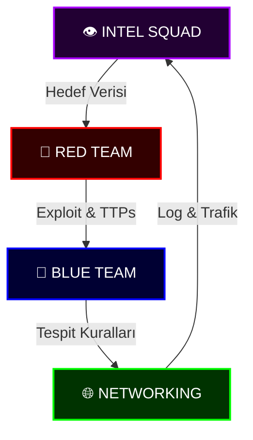

# 🛡️ CYBER SENTINEL: Ulusal Savunma Protokolü


<div align="center">


</div>

> "Dijital harp çağında sessizlik barış değil, sadece sızıntıdan önceki fırtınadır. Biz fırtınayı beklemeyiz; biz güvenlik duvarının *kendisiyiz*."

---

## 🦅 Görev Emri: Dijital Egemenlik

**Cyber Sentinel** sadece bir depo değil; bir **Ulusal Siber Savunma Harekat Merkezi**dir. Dijital sınırların elit koruması için tasarlanan bu platform, taarruz yeteneklerini, savunma stratejilerini ve derin istihbarat analizlerini birleştirir.

Tek bir mandamız var: **Dijital alanı güvenceye almak, savunmak ve fethetmek.**

---

## 🧠 Operasyonel İstihbarat Döngüsü

Birimlerimiz birbirinden bağımsız çalışmaz. İstihbarat, saldırıyı besler; saldırı, savunmayı güçlendirir.



---

## 📂 Protokol Haritası (Repository Tree)

Harekat merkezimizin taktiksel yerleşimi:

```text
CYBER_SENTINEL/
├── 🔴 DOMINION_RED_TEAM/       # Taarruz Kuvvetleri
│   ├── 📂 TOOLS/               # sentinel_recon.py
│   └── 📜 README.md            # "Kızıl Kitap"
├── 🔵 DOMINION_BLUE_TEAM/      # Savunma Kuvvetleri
│   ├── 📂 TOOLS/               # sentinel_integrity.py
│   └── 📜 README.md            # "Mavi Kodeks"
├── 👁️ DOMINION_INTEL/          # İstihbarat Teşkilatı
│   ├── 📂 TOOLS/               # sentinel_whois.py
│   └── 📜 README.md            # "Gören Göz"
├── 🔐 DOMINION_CRYPTOGRAPHY/   # Şifre Bilimi
│   ├── 📂 TOOLS/               # sentinel_hasher.py
│   └── 📜 README.md            # "The Cipher"
├── 🎭 DOMINION_HUMAN/          # İnsan Faktörü
│   ├── 📂 TOOLS/               # sentinel_phish.py
│   └── 📜 README.md            # "The Mind"
├── 🔌 DOMINION_HARDWARE/       # Donanım Güvenliği
│   ├── 📂 TOOLS/               # sentinel_serial.py
│   └── 📜 README.md            # "The Silicon"
├── ☁️ DOMINION_CLOUD/          # Bulut Güvenliği
│   ├── 📂 TOOLS/               # sentinel_bucket.py
│   └── 📜 README.md            # "The Sky"
├── 📡 DOMINION_WIRELESS/       # Kablosuz Ağlar
│   ├── 📂 TOOLS/               # sentinel_wifi.py
│   └── 📜 README.md            # "The Ether"
├── 🌐 DOMINION_NETWORKING/     # Altyapı Birimi
│   └── 📜 README.md            # "Şebeke"
├── 📜 CONTRIBUTING.md          # Katılım Protokolü
└── 📜 SECURITY.md              # Zafiyet Bildirimi
```

---

## 📜 Siber Doktrin: Asimetrik Doğrulama

Siber güvenlik, asimetrik bir savaştır. Saldırganın sadece bir kez başarılı olması gerekirken, savunmacının her zaman başarılı olması gerekir. Bu dengesizliği yönetmek için doktrinimiz üç sütuna dayanır:

1.  **Görünürlük (Visibility)**: Görmediğini savunamazsın. Ağdaki her paketi, diskteki her baytı bilmelisin.
2.  **Kararlılık (Resilience)**: Sistemler ihlal edilebilir; önemli olan ne kadar hızlı ayağa kalktıklarıdır.
3.  **Hücum Odaklı Savunma (Offensive Defense)**: Düşmanın taktiklerini bilmeden savunma kurulamaz. Red Team, Blue Team'i eğitir; Blue Team, Red Team'i zorlar.

---

## 🗺️ Saha Operasyonları: DOMINIONS (Hükümranlık Alanları)

Operasyonel mimarimiz, siber harbin belirli tiyatroları için özelleşmiş stratejik **Dominion**'lara (Alanlara) bölünmüştür. Her alan kendi derinlemesine bilgi tabanına (Knowledge Base) sahiptir.

### [🔴 DOMINION: RED TEAM (Taarruz Operasyonları)](DOMINION_RED_TEAM/README.md)
*Düşmanı anlamak için düşman ol.*
- **Kızıl Kitap**: Taarruz Doktrini ve Saldırı Yaşam Döngüsü.
- **Sızma Testleri**: Altyapı dayanıklılığını test etmek için gelişmiş metodolojiler.
- **📕 RTFM**: Nmap, Metasploit ve Reverse Shell için saha notları.
- **Araçlar**: `Metasploit`, `Burp Suite`, `Cobalt Strike`.

### [🔵 DOMINION: BLUE TEAM (Savunma Operasyonları)](DOMINION_BLUE_TEAM/README.md)
*Hiç uyumayan kalkan.*
- **Mavi Kodeks**: Savunma stratejileri ve Olay Müdahale (NIST).
- **📘 BTFM**: Kritik Event ID'leri ve Müdahale Kontrol Listeleri.
- **SOC Operasyonları**: Gerçek zamanlı izleme ve Tehdit Avcılığı.
- **Dijital Foreks**: Delil toplama ve analiz.

### [👁️ DOMINION: INTEL (İstihbarat & OSINT)](DOMINION_INTEL/README.md)
*Bilgi güçtür. Mutlak bilgi ise tahakkümdür.*
- **Gören Göz**: İstihbarat döngüsü ve veri toplama.
- **📒 OSINTDB**: Google Dorks ve İstihbarat Araçları veritabanı.
- **APT Analizi**: Devlet destekli tehdit gruplarının profilleri.

### [🎭 DOMINION: HUMAN (İnsan Faktörü)](DOMINION_HUMAN/README.md)
*Zihin en savunmasız işletim sistemidir.*
- **Phishing**: Oltalama ve Spear Phishing teknikleri.
- **Psikoloji**: Cialdini'nin ikna prensipleri.
- **Araçlar**: `Gophish`, `SET` ve `sentinel_phish.py`.

### [🔌 DOMINION: HARDWARE (Donanım Güvenliği)](DOMINION_HARDWARE/README.md)
*Silikonun arka kapıları.*
- **Arayüzler**: UART, JTAG ve SPI hacking.
- **BadUSB**: Klavye emülasyonu saldırıları.
- **Araçlar**: Logic Analyzer ve `sentinel_serial.py`.

### [☁️ DOMINION: CLOUD (Bulut Güvenliği)](DOMINION_CLOUD/README.md)
*Gökyüzündeki kale.*
- **AWS/Azure**: Paylaşılan Sorumluluk Modeli.
- **IAM**: Kimlik yönetimi ve yetki karmaşası.
- **S3 Bucket**: Halka açık veri sızıntılarını tespit etme.
- **Araçlar**: `Pacu`, `ScoutSuite`, `Prowler`.

### [📡 DOMINION: WIRELESS (Kablosuz Ağlar)](DOMINION_WIRELESS/README.md)
*Havadaki sırlar.*
- **WPA Handshake**: Şifreli paketleri yakalama.
- **Attacks**: Deauth, Evil Twin ve PMKID saldırıları.
- **Aircrack-ng**: Modmonitor ve kırma işlemleri.

### [🔐 DOMINION: CRYPTOGRAPHY (Şifre Bilimi)](DOMINION_CRYPTOGRAPHY/README.md)
*Matematiğin karanlık şiiri.*
- **Hashing vs Encryption**: Bütünlük ve Gizlilik farkı.
- **Cracking**: `Hashcat` ve `John` ile parola kırma.
- **Steganography**: Resim içine veri gizleme.

### [🌐 DOMINION: NETWORKING (Altyapı Çekirdeği)](DOMINION_NETWORKING/README.md)
*Dünyanın üzerine inşa edildiği kafes.*
- **Şebeke**: OSI Modeli ve TCP/IP derinlikleri.
- **📓 Network Forensics**: Wireshark filtreleri ve paket analizi.
- **Port Güvenliği**: Açık kapıların risk analizi.

---

## ⚠️ Standart Operasyon Prosedürleri (SOP)

Bu repo üzerindeki her türlü çalışma aşağıdaki standartlara uymalıdır:

1.  **Etik İlkeler**: Sadece izinli sistemlerde (yasal sınırlar içinde) test yapılır.
2.  **Belgeleme**: Yapılan her işlem, oluşturulan her script belgelenmelidir.
3.  **Güvenlik**: Bu repo içerisinde **asla** canlı zararlı yazılım (live malware) barındırılmaz. Sadece de-aktif edilmiş örnekler (defanged) bulunur.

---

## 🚀 Stratejik Yol Haritası (Eğitim & Sertifikasyon)

Operasyonlarımızı küresel standartlar ve ulusal inisiyatiflerle hizalıyoruz.

| Rozet | Sertifika Yolu | Durum |
| :--- | :--- | :--- |
|  | **Ulusal Siber Kampı** | 🟩 Aktif |
|  | **Certified Ethical Hacker** | 🟨 Devam Ediyor |
|  | **Offensive Security Certified Professional** | ⬜ Planlandı |

---

## 🤝 Protokole Katıl

Katkı, güvenliğin can damarıdır. Bir betiğiniz, bir metodolojiniz veya bir keşfiniz varsa:

1. Protokolü **Fork**layın.
2. Uzmanlık alanınıza göre **Branch** (Dal) oluşturun.
3. İstihbaratınızı **Push**layın.

> **"Kod kanundur. Güvenlik ise nizamdır."**

---
*© 2024 Cyber Sentinel İnisiyatifi. Tüm Hakları Saklıdır.*
